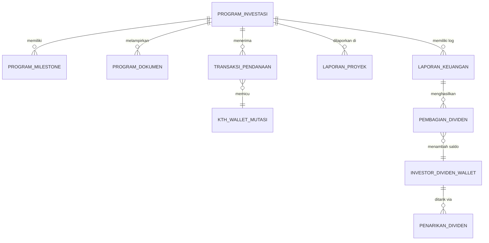

# Struktur Database - Modul Transparansi dan Manajemen Investasi

Berdasarkan PRD dan `prosedur.md`, berikut adalah rancangan struktur tabel (skema database) khusus untuk **service-invest**. 

> [!NOTE]
> Karena Autentikasi dan Manajemen User berada di `service-user`, field seperti `investor_id`, `user_id` (sebagai KTH), `staff_bupm_id`, dan `kepala_bupm_id` di bawah ini merupakan *foreign key* bayangan (reference ID) yang merujuk pada data di `service-user`.

## Entity Relationship Diagram (ERD) Konseptual

---

## Detail Tabel

### 1. `program_investasi`
Tabel utama untuk menyimpan data pengajuan program investasi dari KTH.
- `id` (UUID, Primary Key)
- `user_id` (UUID, Ref -> service-user) - *Mewakili entitas KTH*
- `nama_program` (Varchar 255)
- `kategori_usaha` (Varchar 100)
- `target_dana` (Decimal/Numeric)
- `dana_terkumpul` (Decimal/Numeric) - *Default 0*
- `persentase_keuntungan` (Decimal 5,2) - *Estimasi RoI*
- `periode_kontrak_bulan` (Int)
- `batas_waktu_pengumpulan` (Date/Timestamp)
- `deskripsi` (Text)
- `status` (Enum: `DRAFT`, `WAITING_STAFF_VERIFICATION`, `REVISION`, `WAITING_HEAD_APPROVAL`, `ACTIVE`, `FUNDED`, `COMPLETED`)
- `created_at` (Timestamp)
- `updated_at` (Timestamp)

### 2. `program_milestone`
Menyimpan tahapan/milestone dari suatu program investasi.
- `id` (UUID, Primary Key)
- `program_id` (UUID, Foreign Key)
- `judul_milestone` (Varchar 255)
- `deskripsi` (Text)
- `target_tanggal` (Date)
- `status` (Enum: `PENDING`, `IN_PROGRESS`, `COMPLETED`)
- `created_at` (Timestamp)
- `updated_at` (Timestamp)

### 3. `program_dokumen`
Menyimpan dokumen legalitas, proposal, dan foto cover.
- `id` (UUID, Primary Key)
- `program_id` (UUID, Foreign Key)
- `tipe_dokumen` (Enum: `COVER_IMAGE`, `PROPOSAL_BISNIS`, `LEGALITAS`, `TEMPLATE_PERJANJIAN`)
- `file_url` (Varchar 255)
- `created_at` (Timestamp)

### 4. `transaksi_pendanaan`
Mencatat pembayaran/pendanaan dari investor terhadap suatu program.
- `id` (UUID, Primary Key)
- `investor_id` (UUID, Ref -> service-user)
- `program_id` (UUID, Foreign Key)
- `nominal_pendanaan` (Decimal/Numeric)
- `persentase_kepemilikan` (Decimal 5,2) - *Dihitung: (nominal_pendanaan / target_dana) * 100%*
- `status_pembayaran` (Enum: `PENDING`, `SUCCESS`, `FAILED`, `REFUNDED`)
- `metode_pembayaran` (Varchar 100)
- `bukti_transfer_url` (Varchar 255) - *Bisa null jika pakai Payment Gateway otomatis*
- `tanggal_bayar` (Timestamp)
- `created_at` (Timestamp)
- `updated_at` (Timestamp)

### 5. `kth_wallet` & `kth_wallet_mutasi`
**Tabel `kth_wallet`:** (Dompet operasional KTH)
- `id` (UUID, Primary Key)
- `user_id` (UUID, Ref -> service-user) - *Mewakili entitas KTH*
- `saldo_tersedia` (Decimal/Numeric)
- `updated_at` (Timestamp)

**Tabel `kth_wallet_mutasi`:** (Log aliran dana E-Wallet KTH)
- `id` (UUID, Primary Key)
- `kth_wallet_id` (UUID, Foreign Key)
- `referensi_id` (UUID) - *ID transaksi pendanaan / ID penarikan*
- `tipe_mutasi` (Enum: `KREDIT` / Uang Masuk, `DEBIT` / Uang Keluar)
- `nominal` (Decimal/Numeric)
- `keterangan` (Text) - *Contoh: "Pendanaan dari Investor X" atau "Pencairan operasional KTH"*
- `created_at` (Timestamp)

### 6. `laporan_proyek` & `laporan_proyek_dokumen`
**Tabel `laporan_proyek`:**
- `id` (UUID, Primary Key)
- `program_id` (UUID, Foreign Key)
- `milestone_id` (UUID, Foreign Key) - *Bisa null jika laporan umum*
- `deskripsi_kemajuan` (Text)
- `status_verifikasi` (Enum: `PENDING`, `VERIFIED`, `REVISION`)
- `verified_by_staff_id` (UUID, Ref -> service-user)
- `catatan_verifikasi` (Text)
- `created_at` (Timestamp)
- `updated_at` (Timestamp)

**Tabel `laporan_proyek_dokumen`:**
- `id` (UUID, Primary Key)
- `laporan_proyek_id` (UUID, Foreign Key)
- `file_url` (Varchar 255)
- `created_at` (Timestamp)

### 7. `laporan_keuangan`
Laporan finansial berkala oleh KTH yang diverifikasi BUPM.
- `id` (UUID, Primary Key)
- `program_id` (UUID, Foreign Key)
- `periode_awal` (Date)
- `periode_akhir` (Date)
- `total_pendapatan` (Decimal/Numeric)
- `total_pengeluaran` (Decimal/Numeric)
- `laba_bersih` (Decimal/Numeric) - *Dihitung: pendapatan - pengeluaran*
- `bukti_nota_url` (Varchar 255)
- `status_verifikasi` (Enum: `PENDING`, `VERIFIED`, `REJECTED`)
- `verified_by_staff_id` (UUID, Ref -> service-user)
- `catatan_verifikasi` (Text)
- `is_dividends_distributed` (Boolean) - *Flag apakah bagi hasil sudah dieksekusi*
- `created_at` (Timestamp)
- `updated_at` (Timestamp)

### 8. `pembagian_dividen` (Profit Sharing Log)
Menyimpan riwayat hasil kalkulasi bagi hasil 60:40 per transaksi laporan keuangan.
- `id` (UUID, Primary Key)
- `laporan_keuangan_id` (UUID, Foreign Key)
- `program_id` (UUID, Foreign Key)
- `total_laba_bersih` (Decimal/Numeric)
- `porsi_kth` (Decimal/Numeric) - *60% dari laba bersih*
- `porsi_investor` (Decimal/Numeric) - *40% dari laba bersih*
- `status_distribusi` (Enum: `PENDING`, `DISTRIBUTED`)
- `tanggal_distribusi` (Timestamp)
- `created_at` (Timestamp)

### 9. `investor_dividen_wallet`
Dompet khusus investor untuk menampung keuntungan dari semua portofolionya.
- `id` (UUID, Primary Key)
- `investor_id` (UUID, Ref -> service-user)
- `saldo_dividen` (Decimal/Numeric)
- `updated_at` (Timestamp)

*(Jika diperlukan, bisa ditambah `investor_wallet_mutasi` dengan struktur mirip `kth_wallet_mutasi` untuk mencatat setiap recehan dividen yang masuk).*

### 10. `penarikan_dividen` (Withdrawal)
Permintaan pencairan dividen oleh Investor ke rekening asli mereka.
- `id` (UUID, Primary Key)
- `investor_id` (UUID, Ref -> service-user)
- `nominal_penarikan` (Decimal/Numeric)
- `bank_tujuan` (Varchar 100)
- `nomor_rekening` (Varchar 100)
- `nama_pemilik_rekening` (Varchar 255)
- `status` (Enum: `PENDING`, `APPROVED`, `TRANSFERRED`, `REJECTED`)
- `bukti_transfer_bupm_url` (Varchar 255) - *Bukti TF ke rek Investor*
- `tanggal_proses` (Timestamp)
- `created_at` (Timestamp)
- `updated_at` (Timestamp)
